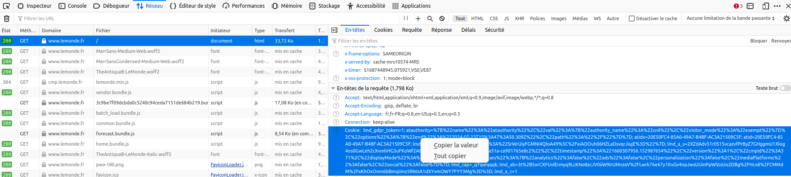

# convert-le-monde-epub

Script Python qui permet de récupérer le contenu des articles du journal Le Monde à partir de leur URL.

L'objectif est de les convertir au format ePUB, afin de pouvoir les lire depuis une liseuse (et s'économiser les yeux !).

> A NOTER : ce script nécessite de disposer d'un jeton d'authentification, donc de s'être préalablement authentifié, et donc de disposer d'un abonnement au site `www.lemonde.fr`. Il ne s'agit **aucunement** de pirater du contenu protégé par des droits d'auteur.

- Autre script qui permet de convertir un fichier HTML en "standalone" (avec les images encodées en base64) : [Standalone_HTML.py](./Standalone_HTML.py)

## Pré-requis

- Python version 3.3 ou supérieure
- Pandoc

> Testé sur un Linux Ubuntu

## Utiliser

[Monter le virtual env Python, et rétablir les paquets requis](./README_Python.md)

## Récupérer le token

Ouvrir la console (mode développeur) du navigateur (par exemple Firefox) :



Récupérer la valeur dans le "Presse-papier".

## Créer un fichier texte contenant la liste des URL des articles

Les URL doivent être séparées par des fins de ligne.

## Lancer le script de récupération des fichiers

```bash
# Le token d'exemple est expiré, remplacer par le votre, entouré par des guillemets doubles
python ./retrieve_articles.py --articleFile article.txt --cookie "lmd_gdpr_token=1; atauthority=%7B%22name%22%3A%22atauthority%22%2C%22val%22%3A%7B%22authority_name%22%3A%22cnil%22%2C%22visitor_mode%22%3A%22exempt%22%7D%2C%22options%22%3A%7B%22end%22%3A%222024-07-23T15%3A55%3A06.944Z%22%2C%22path%22%3A%22%2F%22%7D%7D; atidx=20E50FC4-85A0-49A7-B48F-AC3A21509C5F; atid=20E50FC4-85A0-49A7-B48F-AC3A21509C5F; lmd_sso_twipe=%7B%22token%22%3A%22SrWrUiyFGMNI4QIoA49%5C%2FxiAOOuh06HZLaDsvqrJiujE%3D%22%7D; lmd_a_s=2XZdAdv51r0S15vcazvfPrByZ7GHggmU1Xlog4os0GwLeh2cXvmhHG3uFKoWf2AE; lmd_a_ld=cq%2FED61uukL7lcpak8TTaiZs9zIClG4B15G0HFJLvg0%3D; lmd_a_sp=2XZdAdv51r0S15vcazvfPrByZ7GHggmU1Xlog4os0GwLeh2cXvmhHG3uFKoWf2AE; lmd_stay_connected=0; lmd_a_m=SrWrUiyFGMNI4QIoA49%2FxiAOOuh06HZLaDsvqrJiujE%3D; euconsent-v2=CPdnuOJPdnuOJFzABCFRBdCgAAAAAAAAAAAAAAAAAAAA; lmd_consent=%7B%22userId%22%3A%228ce667c9-04da-4f5f-a51a-ca901765e8c2%22%2C%22timestamp%22%3A%221660307956.152987654%22%2C%22version%22%3A1%2C%22cmpId%22%3A371%2C%22displayMode%22%3A%22subscriber%22%2C%22purposes%22%3A%7B%22analytics%22%3Afalse%2C%22ads%22%3Afalse%2C%22personalization%22%3Afalse%2C%22mediaPlatforms%22%3Afalse%2C%22social%22%3Afalse%7D%7D; lmd_cap=_q7qieqqqk; lmd_ab=3t%2B5xrCXFUvlErmyq9LcKNo8zcJV0iiW9IrUMvzaV%2FLwrk76e67y1ltvGv4npJwsUUinPpWStsUo2DBg%2FHcx8%2FCMMdM%2FxKhOxOnm6bBmqiimz5RWzA1dXYvmOWY7FYY3Mg%3D%3D; lmd_a_c=1"
```

## Lancer le script de conversion en ePUB (nécessite Pandoc)

```bash
```


